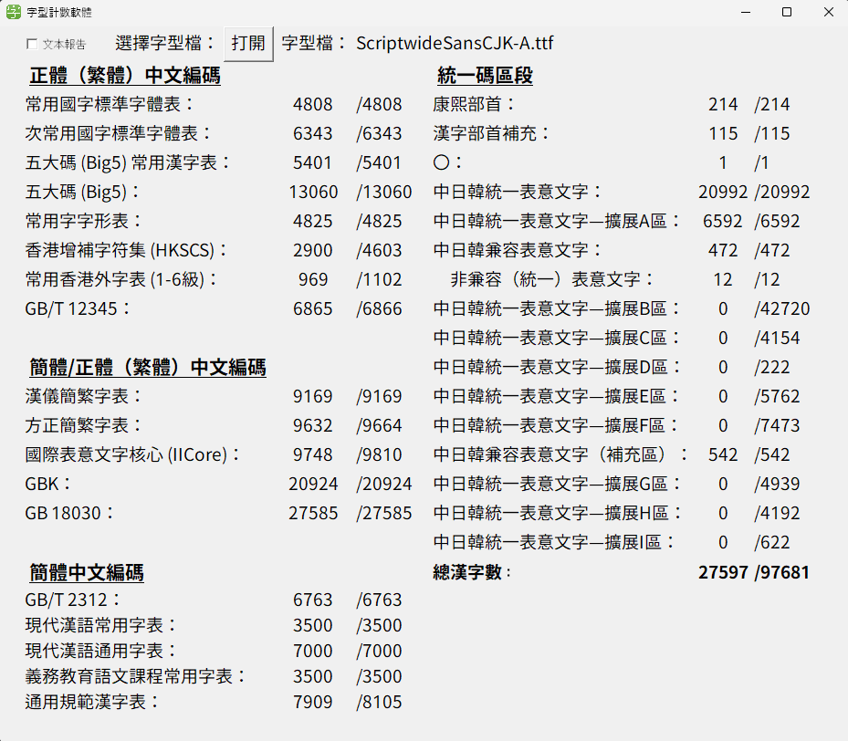
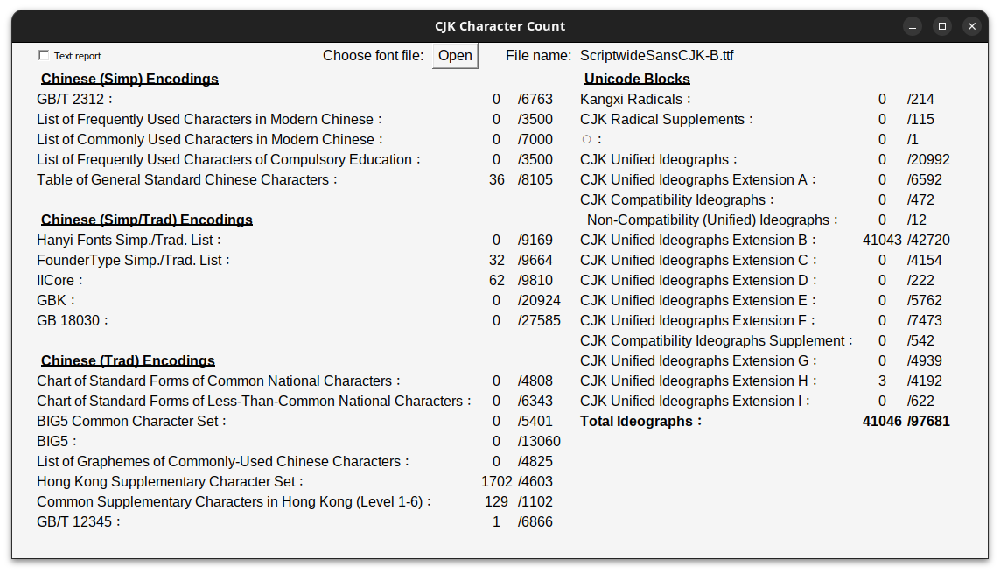
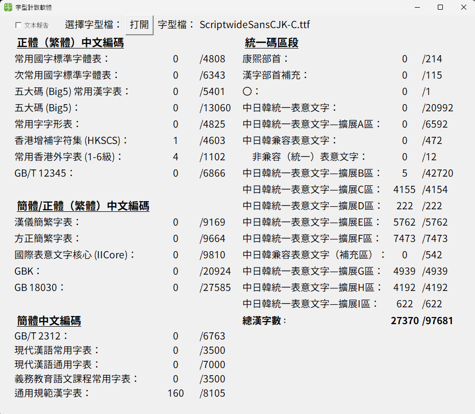

# Scriptwide Sans CJK

Pan-CJK font based on Source Han Sans and its derivatives

*You can already see how bad some of the glyphs are.*

This font is licensed under OFL.

## Description

Very low effort amalgamation of several Source Han Sans-derived fonts with some minute edits.

Note that glyphs are not hinted, so they will look sub-optimal in low resolutions. It is therefore recommended to use Source Han Sans for most CJK ideographs, and use Scriptwide Sans CJK as a fallback.

Furthermore, [Lorchin Sans](https://github.com/Losketch/LorchinSans) should be used as a second fallback font, if sans/gothic style for CJK ideographs is mandatory.

Glyphs do not necessarily follow any source, but most of them should follow either G-source or K-source (as a result of combining G-source Plangothic and K-source (not exactly V-source) Gothic Nguyen.

I plan to convert all glyphs to `K→J→S→V→H→M→T→U→G→P` source, roughly in this fallback order where applicable, but this will probably never happen.

Scriptwide Sans CJK consists of 3 fonts to support as many CJK ideographs as possible.

## A note about an incorrect mapping

I'm too stupid and lazy to contact the Plangothic team, but it is imperative to address that in Plangothic, the glyph for `U+26979 𦥹` should be mapped to `U+22C93 𢲓`. This issue has never been addressed. This will be fixed in the next version of Scriptwide Sans CJK-B.

我不太想直接聯絡遍黑體團隊，但`U+26979 𦥹`的字符應映射到`U+22C93 𢲓`。此將於下一個Scriptwide Sans CJK-B版本中修復。

Below are screenshots from <zi.tools>. 以下為字統網的相關圖片。

`U+22C93`: 

`U+26979`: 

## Coverage

These are screenshots from <https://github.com/NightFurySL2001/CJK-character-count>.

Additionally, Scriptwide Sans CJK covers all of tentative CJK Ext-J thanks to Plangothic, but official Unicode mappings may change.

## Who asked?

1. Why does Scriptwide Sans CJK consist of 3 fonts?
  * Scriptwide Sans CJK-A covers the BMP, Scriptwide Sans CJK-B covers ext-B, and Scriptwide Sans CJK-C covers everything else. One font file can only support 65535 glyphs, therefore the font has to be split.
2. Why not 2 fonts?
  * Good question.
3. Why isn't the entirety of Lorchin Sans directly integrated into Scriptwide Sans CJK?
  * Some glyphs from Lorchin Sans are directly integrated due to the complexity of some glyphs. However, glyphs from Lorchin Sans often do not follow the aesthetics of Source Han Sans.
4. Why do some glyphs look terrible?
  * With the complexity of certain glyphs, they are sometimes directly drawn and bolded.
5. Can I expand on this font?
  * As per the OFL, you are free to do so as long as your font abides to the OFL.
6. What's the point of these questions?
  * I only know that, that's what Damascus, that's what the point of Damascus.
7. Will there be a Chinese version of the README file? README檔會有中文版嗎？
  * Not yet. I plan to create one in the near future. 還沒，不過我計劃在不久的將來建立中文版。

## Disclaimer

This is not a professional font.

Glyphs do not necessarily follow any source.

I am not responsible for any damages caused by misusage of this font, or any misunderstandings that may arise when it is used in any scenario.

If there are inaccuracies in certain glyphs, please create an issue.

## License

As stated above, these fonts are licensed under the Open Font License. Details can be found in [the license file](LICENSE) or [the OFL website](https://openfontlicense.org/).

This portion is partially taken from [the Plangothic repository](https://github.com/Fitzgerald-Porthmouth-Koenigsegg/Plangothic_Project/blob/main/README.en.md#license) and from the OFL website.

Note that the below is not a substitute for legal advice. Please refer to the OFL text for more details.

### You may:

* Install these fonts.
* Modify these fonts.
* Redistribute these fonts, modified or not. (Please ensure the modified font is licensed under the OFL, and does not use any OFL reserved names. Scriptwide itself is NOT a reserved name, but to prevent confusion, I do not recommend using the "Scriptwide" name in any derivative fonts.)
* Use these fonts for all kinds of design work, both commercial and non-commercial, free of charge, without notice.
* Use these fonts without any acknowledgement. (Though this is still very appreciated.)

### You may not:

* Sell any part of the font files on their own.
  * Allegedly there are many online merchants (typically on Taobao) illegally reselling OFL fonts. Please do NOT purchase from them, as this is a serious violation of the OFL.
* Republish these fonts under a non-OFL license.
* Use these fonts for illegal purposes or those that harm the normal operation of computer systems.

## Credits

| Font | Brief Description | Copyright |
| --- | --- | --- |
| [Source Han Sans](https://github.com/adobe-fonts/source-han-sans) | Base font | Google, Adobe |
| [Plangothic](https://github.com/Fitzgerald-Porthmouth-Koenigsegg/Plangothic_Project) | Provided most glyphs | Fitzgerald Porthmouth Koenigsegg [et. al.](https://github.com/Fitzgerald-Porthmouth-Koenigsegg/Plangothic_Project?tab=readme-ov-file#%E8%B4%A1%E7%8C%AE%E8%80%85) |
| [Noto Unicode](https://github.com/MY1L/Unicode/tree/main/NotoUnicode) | Provided modifications of Plangothic glyphs | MY1L |
| [Gothic Nguyen](https://github.com/TKYKmori/Gothic-Nguyen) | Provided some Vietnamese Han Nom glyphs | TKYKmori, Han-Nom Revival Committee of Vietnam |
| [Sukima Gothic](https://oppekebekkanko.booth.pm/items/2117070) | Provided some glyphs | (booth.pm) oppekebekkanko |
| [Yuu Gothic](https://github.com/Steve-Yuu/Yuu-Gothic) | Provided some glyphs | Steve-Yuu |
| [Lorchin Sans](https://github.com/Losketch/LorchinSans) | Provided some components which were edited into the font | Losketch |
